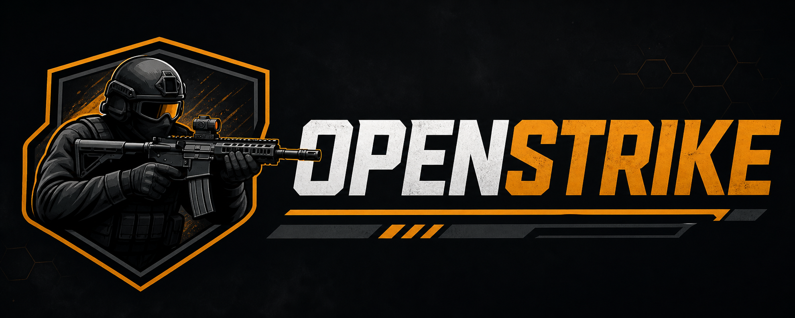

<p align="center">
  
</p>

#

OpenStrike is a small, buildable first-person shooter runtime focused on Counter-Strike style architecture, fixed tick simulation, a client/server split, editor tooling, and a content pipeline.

This repository starts as a small, buildable spine:

- `openstrike_core`: engine loop, runtime config, logging, fixed timestep, simulation, and app modules.
- `openstrike`: executable entry point for client, dedicated server, and editor modes.
- `openstrike_tests`: focused regression tests for deterministic runtime behavior.

## Build

This project uses `sighmake` `.buildscript` files. The generated Visual Studio files are build artifacts, not the source of truth.

Generate projects:

```powershell
sighmake openstrike.buildscript
```

`GenerateProject.bat` runs the same command for Visual Studio users.

Build Debug:

```powershell
sighmake --build . --config Debug --parallel 8
```

Compile DX12 shaders:

```powershell
.\CompileShaders.bat
```

Run tests:

```powershell
.\bin\x64\Debug\OpenStrikeTests.exe
```

Linux/macOS generation uses Sighmake's Makefile generator:

```bash
sighmake openstrike.buildscript -g makefile
sighmake --build . --config Debug --parallel 8
./bin/posix/Debug/OpenStrikeTests
```

On Linux/macOS, SDL3 is resolved through `find_package(SDL3 REQUIRED)` in `thirdparty/SDL3-3.4.4/sdl3.buildscript`, so install the SDL3 development package or provide it through the system package search path before generating.

## Run

```powershell
.\bin\x64\Debug\OpenStrike.exe --frames=120
.\bin\x64\Debug\OpenStrike.exe --dedicated --frames=120
.\bin\x64\Debug\OpenStrike.exe --editor --frames=1
```

Important runtime flags:

- `--dedicated`: run the server module without client/editor behavior.
- `--editor`: run editor mode on top of the normal runtime spine.
- `--renderer=dx12|null`: choose the renderer backend. Client/editor default to custom DX12 on Windows.
- On Linux/macOS, client/editor currently fall back to the null renderer until a native backend is added.
- `--dx12`: shorthand for `--renderer=dx12`.
- `--null-renderer`: run without a graphics backend.
- `--width=N --height=N`: configure the DX12 window size.
- `--no-vsync`: present without vertical sync when DXGI tearing support is available.
- `--frames=N`: stop after `N` rendered frames. Use `0` for an unlimited loop.
- `--tickrate=N`: fixed simulation rate, default `64`.
- `--content-root=PATH`: content root used by asset systems. If omitted, OpenStrike checks `OPENSTRIKE_CONTENT_ROOT`, the current directory, and then `./content`.
- `--quiet`: only warning and error logs.

## Direction

The current code intentionally keeps systems narrow and testable. New systems should land behind focused interfaces and come with tests before they grow into renderer, physics, networking, or editor-specific code.
